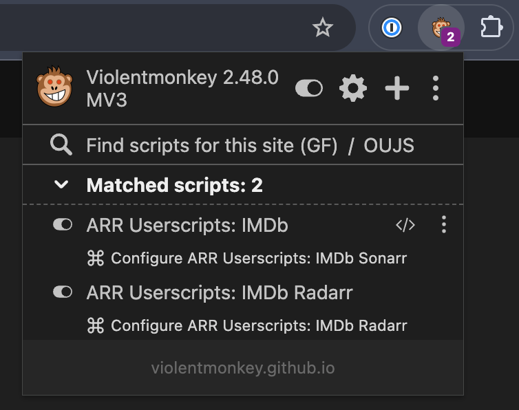

# Arr\* Userscripts

Small browser add-ons that let you send a title you are viewing to your own Sonarr or
Radarr library. They run in a userscript manager such as
[Violentmonkey](https://violentmonkey.github.io/) or
[Tampermonkey](https://www.tampermonkey.net/); you do not need to build anything or
share your server credentials with this project.

## Choose a script

Install the script that matches where and what you browse:

| Script        | Use it when you are viewing | Install                                                                                                              |
| ------------- | --------------------------- | -------------------------------------------------------------------------------------------------------------------- |
| IMDb → Sonarr | a TV series on IMDb         | [Install IMDb → Sonarr](https://github.com/techsquidtv/arr-userscripts/releases/latest/download/imdb.user.js)        |
| IMDb → Radarr | a movie on IMDb             | [Install IMDb → Radarr](https://github.com/techsquidtv/arr-userscripts/releases/latest/download/imdb-radarr.user.js) |
| Plex → Sonarr | a TV show in Plex Web       | [Install Plex → Sonarr](https://github.com/techsquidtv/arr-userscripts/releases/latest/download/plex.user.js)        |

The IMDb scripts identify the title before showing a button: Sonarr appears for TV
series and Radarr appears for movies. They stay out of the way on episodes and pages
where IMDb does not give a reliable answer. The Plex script is similarly conservative:
it appears for TV shows, not music or movies.

## Install in three steps

1. Install Violentmonkey or Tampermonkey in your browser.
2. Choose an install link above and approve the userscript-manager installation
   screen.
3. Visit a matching IMDb or Plex page, open your userscript manager’s menu, and
   choose **Configure Arr\* Userscripts**.

In Violentmonkey, the configuration command appears underneath each matched script.
Choose the command for the service you want to set up:



Enter your Sonarr or Radarr server address, then choose **Load server options**. The
script asks for the API key only for that one request, fetches your configured root
folders and quality profiles, and turns them into readable dropdowns. Choose the
library location and profile you want, set your preferred monitoring/search options,
then press **Save settings**. The page reloads and is ready to use.

The Plex script can also use your Plex server address to identify items more
accurately. It does not need a root folder or quality profile because it only opens
shows that already exist in Sonarr.

### What happens next

The scripts do not ask for an API key simply because you installed them. They request
it temporarily when you load server options and again, only in page memory, when you
add a title. A server URL alone is not enough: Sonarr and Radarr also need a root
folder and quality profile. **Load folders and profiles (optional)** fetches those
choices from your server, but you can enter the folder path and numeric profile ID
yourself instead. Then open the right kind of detail page:

- **IMDb → Sonarr** adds an **Add to Sonarr** button on a main TV-series page. It
  intentionally does not appear on movie, episode, list, search, or unclear pages.
- **IMDb → Radarr** adds an **Add to Radarr** button on a main movie page. It does
  not appear on TV-series or episode pages.
- **Plex → Sonarr** adds its Sonarr button on a TV-show detail page, not on movie or
  music pages.

When you click an Add button, the script opens a password-style prompt for that
service’s API key. If you do not see a button, open the userscript manager menu and
check **Configure Arr\* Userscripts** first; an incomplete setting is the most common
reason.

## Your API keys stay with you

When a configured script needs to make a request, it asks for its API key in a
password-style prompt. The key is kept only in that browser tab’s memory and is
forgotten when the page reloads or the tab closes. It is not included in downloads,
saved in the userscript settings, or sent to this repository.

Your non-secret choices—such as a server URL and profile—are saved locally by your
userscript manager. They are separate for each script and browser profile, so it is
normal to configure IMDb → Sonarr and Plex → Sonarr independently. A password manager
may fill the key prompt if you use one.

## Updates

The install links always point to the latest published release. Userscript managers
can check them for updates automatically. Saved settings survive an update.

Every script also has a small, readable defaults block directly below its metadata
header. You may edit that block before installing, but use the configuration menu for
settings you want to keep: an update replaces edited defaults while preserving saved
settings.

The public Plex script is the exception when you add a self-hosted Plex Web address:
an edited `@match` rule is source code, so an official update would replace that
customization. Use one of the options below.

## Using a self-hosted Plex Web address

The public Plex download runs on `https://app.plex.tv/*`. A userscript manager decides
where a script can run before its settings page opens, so adding a Plex server URL in
the dialog cannot enable another web address.

### Quick one-time setup

You do not need to build the project or edit minified application code. Install the
public [Plex → Sonarr script](https://github.com/techsquidtv/arr-userscripts/releases/latest/download/plex.user.js),
then open that script’s code editor in Violentmonkey or Tampermonkey. At the very top
of the file, inside the readable `UserScript` header, add one exact line:

```javascript
// @match https://plex.example.com/*
```

Save the script, then turn off automatic updates for that customized Plex copy. This
is the simplest option for one host. A separate unminified release would not improve
this workflow: the header is already readable, and an update would still replace a
hand-edited rule.

### Personal Plex release with automatic updates

For a self-hosted Plex Web address that should continue receiving updates, create a
fork of this repository and use its included **Publish personal Plex userscript**
workflow:

1. Open the **Actions** tab in your fork and enable workflows if GitHub asks.
2. Select **Publish personal Plex userscript**, choose **Run workflow**, and enter
   one or more comma-separated Plex Web origins, such as
   `https://plex.example.com`.
3. When it completes, install this script from your fork, replacing the placeholders:

   ```text
   https://github.com/<fork-owner>/<fork-repository>/releases/download/personal-plex/plex.user.js
   ```

The workflow creates a secret-free script with your exact `@match` rules. It updates
the same `personal-plex` release asset on each run, so your userscript manager can
update it automatically without losing those rules. To take upstream improvements,
sync your fork with this repository and run the workflow again. Plex hostnames are
not credentials; do not put API keys or Plex tokens in the workflow input.

## Troubleshooting

- **No button appears on IMDb:** Open a main movie or TV-series page, rather than an
  episode, list, or search page. The script deliberately waits until it can identify
  the title type.
- **No button appears in Plex:** Open a TV-show detail page. The script does not run
  for music or movies.
- **The request fails:** Check the server URL, API key, root folder, and quality
  profile in **Configure Arr\* Userscripts**. The server must be reachable from your
  browser.
- **I need to start again:** Choose **Reset saved settings** in the configuration
  dialog. This clears only the local non-secret configuration for that one script.

## For contributors

This repository is a pnpm workspace built with [Vite+](https://viteplus.dev/). The
scripts share their user-interface, settings, ARR API, and metadata tooling so fixes
can benefit every script. Releases are created by GitHub Actions from version tags;
release downloads always contain blank defaults and no credentials.

```bash
vp install
vp check
vp test
vp run build
```

The bundled Sonarr, Radarr, and Plex icons are sourced from
[selfhst/icons](https://github.com/selfhst/icons).
